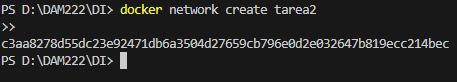
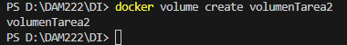
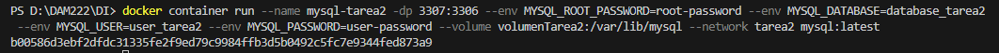
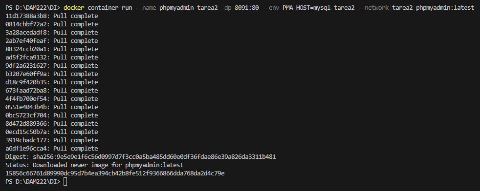
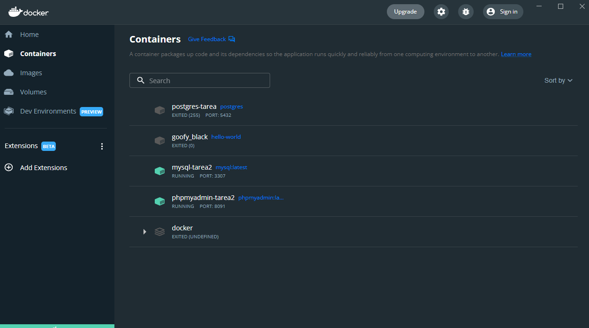
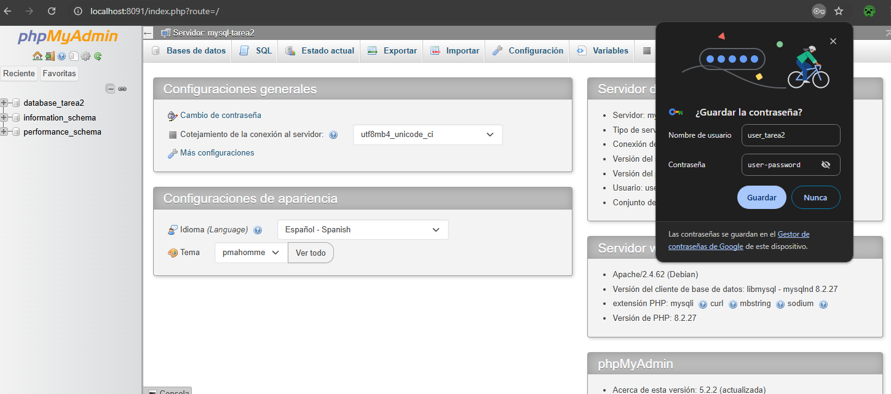

<!--  -->

### **Tarea: Crear red, servicios y volumen**

### **Informe de los pasos**

#### Paso 1: Crear red `tarea2`
Ejecutamos el comando:
```bash
docker network create tarea2
```



#### Paso 2: Crear volumen `volumenTarea2`
Comando utilizado:
```bash
docker volume create volumenTarea2
```



#### Paso 3: Ejecutar contenedores
**MySQL:**
```bash
docker container run \
--name mysql-tarea2 \
-dp 3307:3306 \
--env MYSQL_ROOT_PASSWORD=root-password \
--env MYSQL_DATABASE=database_tarea2 \
--env MYSQL_USER=user_tarea2 \
--env MYSQL_PASSWORD=user-password \
--volume volumenTarea2:/var/lib/mysql \
--network tarea2 \
mysql:latest
```



**phpMyAdmin:**
```bash
docker container run \
--name phpmyadmin-tarea2 \
-dp 8091:80 \
--env PMA_HOST=mysql-tarea2 \
--network tarea2 \
phpmyadmin:latest
```



---

### **Verificación**

1. Accede a `phpMyAdmin` en tu navegador a través de `http://localhost:8091`.
2. Usa las credenciales:
   - **Servidor:** `mysql-tarea2`
   - **Usuario:** `user_tarea2`
   - **Contraseña:** `user-password`
3. Verifica que puedes conectar a la base de datos `database_tarea2`.



