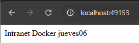

<style>
.note-box {
  background-color: #f8f9fc;
  border-left: 6px solid #4a90e2;
  padding: 15px;
  border-radius: 8px;
  box-shadow: 2px 2px 10px rgba(0, 0, 0, 0.1);
  font-family: "Arial", sans-serif;
}

.note-box h3 {
  margin-top: 0;
  color: #4a90e2;
  font-size: 1.2em;
}

.note-box p {
  margin: 5px 0 0;
  color: #333;
}
.important-box {
  background-color: #fff3cd;
  border-left: 6px solid #ffc107;
  padding: 15px;
  border-radius: 8px;
  box-shadow: 2px 2px 10px rgba(0, 0, 0, 0.1);
  font-family: "Arial", sans-serif;
}

.important-box h3 {
  margin-top: 0;
  color: #e0a800;
  font-size: 1.2em;
}

.important-box p {
  margin: 5px 0 0;
  color: #856404;
}
</style>
# Tarea Curso Docker

### Nombre: Fabio 

### Apellidos: Prieto Álvarez

---

- [Laboratorio 1: Comandos básicos](#laboratorio-1-comandos-básicos)
- [Laboratorio 2: Publicar una imagen en Docker Hub](#laboratorio-2-publicar-una-imagen-en-docker-hub)
- [Laboratorio 3: Configuración de Docker Compose para MySQL y WordPress](#laboratorio-3-explique-la-siguiente-configuración-de-este-archivo-docker-compose-para-desplegar-un-entorno-de-mysql-y-wordpress)
- [Laboratorio 4: Comandos de Docker Compose](#laboratorio-4-explique-los-siguientes-comandos-de-docker-compose)
- [Laboratorio 5: Explicación de estructuras de Docker Compose](#laboratorio-5-explique-las-siguientes-estructuras-de-los-campos-de-docker-compose-que-faltan-por-comentar)

---

### **Laboratorio 1: Comandos básicos**

#### **1. Comando para parar todos los contenedores**

```bash
docker stop $(docker ps -q)
```
```powershell
PS D:\DAM222\DI> docker stop $(docker ps -q)
3625552c059f
29445bcd4449
```

<div class="note-box">
  <h3>📌 Nota</h3>
  <p>Encendí un contenedor para poder tener respuesta.</p>
</div>

#### **2. Comando para eliminar todos los contenedores**

```bash
docker rm $(docker ps -aq)
```
```powershell
PS D:\DAM222\DI> docker rm $(docker ps -aq --filter "status=exited") 
dd78f792554f
9d1486bebf2b
15856c66761d
b00586d3ebf2
6a4cc84a9e21
f5a90c9850b6
```
<div class="important-box">
  <h3>❗ Importante</h3>
  <p>ejecuto el comando con un filtro para eliminar los contenedores que no estén en ejecución evitando así la eliminación de contenedores innecesarios.</p>
</div>

#### **3. Lanzar un contenedor llamado `web1` con la imagen `agarciaf/intranet`**

```bash
docker run -d --name web1 agarciaf/intranet
```

```powershell
PS D:\DAM222\DI> docker run -d --name web1 agarciaf/intranet
Unable to find image 'agarciaf/intranet:latest' locally
latest: Pulling from agarciaf/intranet
a3ed95caeb02: Pull complete
35d9d5d11536: Pull complete
c422cdb256a9: Pull complete
665c411390e3: Pull complete
8fc0c0a1c4fe: Pull complete
bc31532139f0: Pull complete
555193311939: Pull complete
50197e4977e2: Pull complete
11cf2fa9714b: Pull complete
88d7e466811c: Pull complete
6969966ecc41: Pull complete
f99014094379: Pull complete
31ec0d0094d4: Pull complete
54cfd34f58b8: Pull complete
f8c1adcda761: Pull complete
Digest: sha256:a6c66644ee7547ea2f17de07dc67f11307b469fe5c9002dfc38433bad5f269c5
Status: Downloaded newer image for agarciaf/intranet:latest
3ac4a08fc3ae43193abcaffcc82807e42830ad54d9f6eab03935ad2425bac3dd
PS D:\DAM222\DI> docker ps -a
CONTAINER ID   IMAGE                          COMMAND                  CREATED          STATUS                       PORTS                               NAMES
3ac4a08fc3ae   agarciaf/intranet              "supervisord -n"         10 seconds ago   Exited (139) 7 seconds ago                                       web1
3625552c059f   phpmyadmin/phpmyadmin:latest   "/docker-entrypoint.…"   3 weeks ago      Up 11 minutes                0.0.0.0:8081->80/tcp                phpmyadmin-container
29445bcd4449   mysql:latest                   "docker-entrypoint.s…"   3 weeks ago      Up 11 minutes                33060/tcp, 0.0.0.0:3307->3306/tcp   mysql-container
```

#### **4. Lanzar un contenedor llamado `bd1` con la imagen `mariadb`**

```bash
docker container run `
 --name bd1 -dp 3308:3306 `
 -e MARIADB_USER=user `
 -e MARIADB_PASSWORD=password `
 -e MARIADB_ROOT_PASSWORD=root-password `
 -e MARIADB_DATABASE=world-db `
 mariadb
```

```powershell
PS D:\DAM222\DI> docker container run `
>> --name bd1 -dp 3308:3306 `
>> -e MARIADB_USER=user `
>> -e MARIADB_PASSWORD=password `
>> -e MARIADB_ROOT_PASSWORD=root-password `
>> -e MARIADB_DATABASE=world-db `
>> mariadb
6ee252ebc949abbd7743a0f52a7185838ace7610bb68027b5ce5d0df676af28c
PS D:\DAM222\DI> docker ps -a   
CONTAINER ID   IMAGE                          COMMAND                  CREATED          STATUS                        PORTS                               NAMES
6ee252ebc949   mariadb                        "docker-entrypoint.s…"   4 seconds ago    Up 4 seconds                  0.0.0.0:3308->3306/tcp              bd1
3ac4a08fc3ae   agarciaf/intranet              "supervisord -n"         11 minutes ago   Exited (139) 11 minutes ago                                       web1
3625552c059f   phpmyadmin/phpmyadmin:latest   "/docker-entrypoint.…"   3 weeks ago      Up 22 minutes                 0.0.0.0:8081->80/tcp                phpmyadmin-container
29445bcd4449   mysql:latest                   "docker-entrypoint.s…"   3 weeks ago      Up 22 minutes                 33060/tcp, 0.0.0.0:3307->3306/tcp   mysql-container
```

#### **5. Lanzar un contenedor llamado `bd2` con la imagen `postgres`**

```bash
docker container run `
 -d `
 --name bd2 `
 -e POSTGRES_PASSWORD=password `
 -v postgres-db:/var/lib/postgresql/data `
 postgres:15.1
```

```powershell
PS D:\DAM222\DI> docker container run `
>> -d `
>> --name bd2 `
>> -e POSTGRES_PASSWORD=password `
>> -v postgres-db:/var/lib/postgresql/data `
>> postgres:15.1
Unable to find image 'postgres:15.1' locally
15.1: Pulling from library/postgres
bb263680fed1: Pull complete
75a54e59e691: Pull complete
3ce7f8df2b36: Pull complete
f30287ef02b9: Pull complete
dc1f0e9024d8: Pull complete
7f0a68628bce: Pull complete
32b11818cae3: Pull complete
48111fe612c1: Pull complete
07b5cb2894c7: Pull complete
7cca76b73db0: Pull complete
87f7b375a7d2: Pull complete
d9daaa1dc184: Pull complete
536a8b356450: Pull complete
Digest: sha256:02547253a07e6edd0c070caba1d2a019b7dc7df98b948dc9a909e1808eb77024
Status: Downloaded newer image for postgres:15.1
8e9467581667ccd57ede0d92fc18b3dcd487a8cfea06bda9a8f922eb9a012188
PS D:\DAM222\DI> docker ps -a
CONTAINER ID   IMAGE                          COMMAND                  CREATED          STATUS                        PORTS                               NAMES
8e9467581667   postgres:15.1                  "docker-entrypoint.s…"   27 seconds ago   Up 27 seconds                 5432/tcp                            bd2
6ee252ebc949   mariadb                        "docker-entrypoint.s…"   6 minutes ago    Up 6 minutes                  0.0.0.0:3308->3306/tcp              bd1
3ac4a08fc3ae   agarciaf/intranet              "supervisord -n"         17 minutes ago   Exited (139) 17 minutes ago                                       web1
3625552c059f   phpmyadmin/phpmyadmin:latest   "/docker-entrypoint.…"   3 weeks ago      Up 29 minutes                 0.0.0.0:8081->80/tcp                phpmyadmin-container
29445bcd4449   mysql:latest                   "docker-entrypoint.s…"   3 weeks ago      Up 29 minutes                 33060/tcp, 0.0.0.0:3307->3306/tcp   mysql-container
```

#### **6. Lanzar un contenedor llamado `web2` que exponga el puerto en nuestra máquina `81` basado en la imagen `nginx`, y que se reinicie siempre**

```bash
docker run -d --name web2 -p 81:80 --restart always nginx
```

```powershell
PS D:\DAM222\DI> docker run -d --name web2 -p 81:80 --restart always nginx
Unable to find image 'nginx:latest' locally
latest: Pulling from library/nginx
af302e5c37e9: Already exists                                                                                                                                                                                                                                                                                                          
207b812743af: Pull complete
841e383b441e: Pull complete
0256c04a8d84: Pull complete
38e992d287c5: Pull complete
9e9aab598f58: Pull complete
4de87b37f4ad: Pull complete
Digest: sha256:0a399eb16751829e1af26fea27b20c3ec28d7ab1fb72182879dcae1cca21206a
Status: Downloaded newer image for nginx:latest
9de8f93be10788d0ec3e5ea9467b3740e0ee5b46ac12b73c863a371e8d76cd39
PS D:\DAM222\DI> docker ps -a
CONTAINER ID   IMAGE                          COMMAND                  CREATED          STATUS                        PORTS                               NAMES
9de8f93be107   nginx                          "/docker-entrypoint.…"   30 seconds ago   Up 29 seconds                 0.0.0.0:81->80/tcp                  web2
8e9467581667   postgres:15.1                  "docker-entrypoint.s…"   3 minutes ago    Up 3 minutes                  5432/tcp                            bd2
6ee252ebc949   mariadb                        "docker-entrypoint.s…"   9 minutes ago    Up 9 minutes                  0.0.0.0:3308->3306/tcp              bd1
3ac4a08fc3ae   agarciaf/intranet              "supervisord -n"         20 minutes ago   Exited (139) 20 minutes ago                                       web1
3625552c059f   phpmyadmin/phpmyadmin:latest   "/docker-entrypoint.…"   3 weeks ago      Up 32 minutes                 0.0.0.0:8081->80/tcp                phpmyadmin-container
29445bcd4449   mysql:latest                   "docker-entrypoint.s…"   3 weeks ago      Up 32 minutes                 33060/tcp, 0.0.0.0:3307->3306/tcp   mysql-container
```

#### **7. ¿Qué IP tienen los contenedores `web1` y `web2`?**

```bash
docker inspect id_contenedor/nombre_contenedor
```

```powershell
PS D:\DAM222\DI> docker inspect --format '{{range .NetworkSettings.Networks}}{{.IPAddress}}{{end}}' web1

PS D:\DAM222\DI> docker inspect --format '{{range .NetworkSettings.Networks}}{{.IPAddress}}{{end}}' web2
172.17.0.4
```

<div class="note-box">
  <h3>📌 Nota</h3>
  <p>Intenté encender el contenedor <code>web1</code>, pero no funciona. El contenedor se detiene inmediatamente con el código de salida <strong>139</strong>, lo que indica un posible fallo de segmentación o error en el proceso.</p>
</div>
<br>

 <div class="note-box">
   <h3>📌 Nota</h3>
   <p><strong>El parámetro <code>--format</code> en el comando <code>docker inspect</code></strong> se utiliza para personalizar la salida de información, permitiéndote extraer solo los datos que necesitas, en lugar de mostrar toda la información de  forma detallada. En este caso, <code>--format '{{range .NetworkSettings.Networks}}{{.IPAddress}}{{end}}'</code> extrae la dirección IP del contenedor, si está disponible, de las configuraciones de red.</p>
 </div>


#### **8. Comando para ver las estadísticas del contenedor `web1` y `web2`**

```bash
docker stats
```

```powershell
CONTAINER ID   NAME                   CPU %     MEM USAGE / LIMIT     MEM %     NET I/O       BLOCK I/O   PIDS
9de8f93be107   web2                   0.00%     17.01MiB / 15.54GiB   0.11%     1.01kB / 0B   0B / 0B     17
8e9467581667   bd2                    0.00%     22.53MiB / 15.54GiB   0.14%     1.01kB / 0B   0B / 0B     6
6ee252ebc949   bd1                    0.02%     189.8MiB / 15.54GiB   1.19%     1.3kB / 0B    0B / 0B     8
3625552c059f   phpmyadmin-container   0.01%     16.17MiB / 15.54GiB   0.10%     1.26kB / 0B   0B / 0B     6
29445bcd4449   mysql-container        0.58%     470.2MiB / 15.54GiB   2.96%     1.37kB / 0B   0B / 0B     38
```

---

### **Laboratorio 2: Publicar una imagen en Docker Hub**

En este laboratorio seguiremos este procedimiento para lanzan un contenedor y convertirlo a imagen, tras la conversión a imagen subiremos dicha imagen a nuestro Docker hub, en el cual tendremos que tener creada una cuenta para poder realizar dicho laboratorio.

[docker](https://hub.docker.com/)

Partimos de la imagen httpd que tiene como document-root el directorio: `/usr/local/apache2/htdocs`


#### **1. Lanzamos contenedor intranet**

```bash
docker run -dtiP --name intranet httpd
```

```powershell
PS D:\DAM222\DI> docker run -dtiP --name intranet httpd
Unable to find image 'httpd:latest' locally
latest: Pulling from library/httpd
c29f5b76f736: Pull complete
830a84f99cc8: Pull complete
4f4fb700ef54: Pull complete
a1a1b409f475: Pull complete
35b1ecb71608: Pull complete
80350326cd93: Pull complete
Digest: sha256:3195404327ecd95b2fa0a5d4eac1f2206bb12996fb2561393f91254759e422b9
Status: Downloaded newer image for httpd:latest
2b8c7a1878b06d08ac7eab83fcd2caa0cf6b0e458918b4139044040526eac2f5
PS D:\DAM222\DI> docker ps
CONTAINER ID   IMAGE     COMMAND                  CREATED         STATUS          PORTS                   NAMES
2b8c7a1878b0   httpd     "httpd-foreground"       9 seconds ago   Up 8 seconds    0.0.0.0:49153->80/tcp   intranet
9de8f93be107   nginx     "/docker-entrypoint.…"   5 days ago      Up 22 seconds   0.0.0.0:81->80/tcp      web2
```

#### **2. Entramos en el contenedor y creamos un index.html**

```bash
docker exec -ti intranet /bin/bash  # Accede al contenedor "intranet" en modo interactivo
cd /usr/local/apache2/htdocs        # Navega a la carpeta donde Apache almacena sus archivos HTML
mv index.html index.html-copia      # Renombra index.html como backup
echo "Intranet Docker jueves06" > index.html  # Sobrescribe index.html con el nuevo contenido
exit  # Sale del contenedor

```

```
PS D:\DAM222\DI> docker exec -ti intranet /bin/bash
root@2b8c7a1878b0:/usr/local/apache2# cd /usr/local/apache2/htdocs
root@2b8c7a1878b0:/usr/local/apache2/htdocs# mv index.html index.html-copia
root@2b8c7a1878b0:/usr/local/apache2/htdocs# echo "Intranet Docker jueves06" > index.html
root@2b8c7a1878b0:/usr/local/apache2/htdocs# exit
exit
PS D:\DAM222\DI> 
```

#### **3. Nos salimos del contenedor y visualizamos los puertos que tenemos nateados**

```bash
docker ps -l
```

```powershell
PS D:\DAM222\DI> docker ps -l
CONTAINER ID   IMAGE     COMMAND              CREATED         STATUS         PORTS                   NAMES
2b8c7a1878b0   httpd     "httpd-foreground"   4 minutes ago   Up 4 minutes   0.0.0.0:49153->80/tcp   intranet
PS D:\DAM222\DI> 
```



#### **4. Salvamos el contenedor a imagen**

```bash
docker commit -m "Intranet-Tarea" intranet intranet
```

```powershell
Digest: sha256:3195404327ecd95b2fa0a5d4eac1f2206bb12996fb2561393f91254759e422b9

PS D:\DAM222\DI> docker history e58f1d3d8eb3
IMAGE          CREATED          CREATED BY                                      SIZE      COMMENT
e58f1d3d8eb3   58 seconds ago   httpd-foreground                                182B      Intranet-Tarea
4d98e80840bb   13 days ago      CMD ["httpd-foreground"]                        0B        buildkit.dockerfile.v0
<missing>      13 days ago      EXPOSE map[80/tcp:{}]                           0B        buildkit.dockerfile.v0
<missing>      13 days ago      COPY httpd-foreground /usr/local/bin/ # buil…   138B      buildkit.dockerfile.v0
<missing>      13 days ago      STOPSIGNAL SIGWINCH                             0B        buildkit.dockerfile.v0
<missing>      13 days ago      RUN /bin/sh -c set -eux;   savedAptMark="$(a…   62.4MB    buildkit.dockerfile.v0
<missing>      13 days ago      ENV HTTPD_PATCHES=                              0B        buildkit.dockerfile.v0
<missing>      13 days ago      ENV HTTPD_SHA256=88fc236ab99b2864b248de7d49a…   0B        buildkit.dockerfile.v0
<missing>      13 days ago      ENV HTTPD_VERSION=2.4.63                        0B        buildkit.dockerfile.v0
<missing>      13 days ago      RUN /bin/sh -c set -eux;  apt-get update;  a…   11MB      buildkit.dockerfile.v0
<missing>      13 days ago      WORKDIR /usr/local/apache2                      0B        buildkit.dockerfile.v0
<missing>      13 days ago      RUN /bin/sh -c mkdir -p "$HTTPD_PREFIX"  && …   0B        buildkit.dockerfile.v0
<missing>      13 days ago      ENV PATH=/usr/local/apache2/bin:/usr/local/s…   0B        buildkit.dockerfile.v0
<missing>      13 days ago      ENV HTTPD_PREFIX=/usr/local/apache2             0B        buildkit.dockerfile.v0
<missing>      13 days ago      # debian.sh --arch 'amd64' out/ 'bookworm' '…   74.8MB    debuerreotype 0.15
PS D:\DAM222\DI> docker images
REPOSITORY              TAG       IMAGE ID       CREATED              SIZE
intranet-imagen         latest    e58f1d3d8eb3   About a minute ago   148MB
httpd                   latest    4d98e80840bb   13 days ago          148MB
phpmyadmin              latest    1ae727bcaf3e   2 weeks ago          565MB
mysql                   8.0       04faa32c7d29   2 weeks ago          764MB
nginx                   latest    9bea9f2796e2   2 months ago         192MB
mariadb                 latest    6722945a6940   2 months ago         407MB
postgres                latest    4bc6cc20ca7a   2 months ago         435MB
mysql                   latest    56a8c14e1404   3 months ago         603MB
phpmyadmin/phpmyadmin   latest    933569f3a9f6   18 months ago        562MB
hello-world             latest    d2c94e258dcb   21 months ago        13.3kB
postgres                15.1      ccd94e8b5fd9   24 months ago        379MB
agarciaf/intranet       latest    c1435f560b71   7 years ago          641MB
PS D:\DAM222\DI> 
```

<div class="note-box">
   <h3>📌 Nota</h3>
   <p>Le di a Ctrl + L y perdí el resultado de algunos comandos, así que puse el resultado final.</p>
 </div>

#### **5. Eliminamos el contenedor base**

```bash
docker rm -f intranet
```

```powershell
PS D:\DAM222\DI> docker ps
CONTAINER ID   IMAGE     COMMAND              CREATED          STATUS          PORTS                   NAMES
2b8c7a1878b0   httpd     "httpd-foreground"   15 minutes ago   Up 15 minutes   0.0.0.0:49153->80/tcp   intranet
PS D:\DAM222\DI> docker rm -f intranet
intranet
PS D:\DAM222\DI> docker ps -a
CONTAINER ID   IMAGE                          COMMAND                  CREATED       STATUS                      PORTS     NAMES
9de8f93be107   nginx                          "/docker-entrypoint.…"   5 days ago    Exited (0) 15 minutes ago             web2
8e9467581667   postgres:15.1                  "docker-entrypoint.s…"   5 days ago    Exited (0) 5 days ago                 bd2
6ee252ebc949   mariadb                        "docker-entrypoint.s…"   5 days ago    Exited (0) 5 days ago                 bd1
3ac4a08fc3ae   agarciaf/intranet              "supervisord -n"         5 days ago    Exited (139) 5 days ago               web1
3625552c059f   phpmyadmin/phpmyadmin:latest   "/docker-entrypoint.…"   4 weeks ago   Exited (0) 5 days ago                 phpmyadmin-container
29445bcd4449   mysql:latest                   "docker-entrypoint.s…"   4 weeks ago   Exited (0) 5 days ago                 mysql-container
PS D:\DAM222\DI>  
```

#### **6. Lanzamos un nuevo contenedor basado en la imagen creada del contenedor anteriormente:**

```bash
docker run -ditP --name intranet1 intranet-imagen

docker system  df -v
```

```powershell
PS D:\DAM222\DI> docker run -ditP --name intranet1 intranet-imagen
225761fb94e2075446f4f9b32459dcffcc6cb29213c2a4a379034cb0fb1ed8f2
PS D:\DAM222\DI> docker system  df -v
Images space usage:

REPOSITORY              TAG       IMAGE ID       CREATED         SIZE      SHARED SIZE   UNIQUE SIZE   CONTAINERS
intranet-imagen         latest    e58f1d3d8eb3   7 minutes ago   148.2MB   148.2MB       182B          1
httpd                   latest    4d98e80840bb   13 days ago     148.2MB   148.2MB       0B            0
phpmyadmin              latest    1ae727bcaf3e   2 weeks ago     564.5MB   74.77MB       489.7MB       0
mysql                   8.0       04faa32c7d29   2 weeks ago     764.5MB   113.4MB       651.1MB       0
nginx                   latest    9bea9f2796e2   2 months ago    191.7MB   74.77MB       116.9MB       1
mariadb                 latest    6722945a6940   2 months ago    406.9MB   0B            406.9MB       1
postgres                latest    4bc6cc20ca7a   2 months ago    434.8MB   0B            434.8MB       0
mysql                   latest    56a8c14e1404   3 months ago    603.4MB   113.4MB       490MB         1
phpmyadmin/phpmyadmin   latest    933569f3a9f6   18 months ago   561.7MB   0B            561.7MB       1
hello-world             latest    d2c94e258dcb   21 months ago   13.26kB   0B            13.26kB       0
postgres                15.1      ccd94e8b5fd9   24 months ago   378.7MB   0B            378.7MB       1
agarciaf/intranet       latest    c1435f560b71   7 years ago     641.3MB   0B            641.3MB       1

Containers space usage:

CONTAINER ID   IMAGE                          COMMAND                  LOCAL VOLUMES   SIZE      CREATED          STATUS                     
 NAMES
3ac4a08fc3ae   agarciaf/intranet              "supervisord -n"         0               0B        5 days ago       Exited (139) 5 days ago     web1
3625552c059f   phpmyadmin/phpmyadmin:latest   "/docker-entrypoint.…"   0               216kB     4 weeks ago      Exited (0) 5 days ago       phpmyadmin-container
29445bcd4449   mysql:latest                   "docker-entrypoint.s…"   1               0B        4 weeks ago      Exited (0) 5 days ago       mysql-container

Local Volumes space usage:

VOLUME NAME                                                        LINKS     SIZE
postgres-db                                                        1         40.25MB
volumenTarea2                                                      0         209.1MB
2b058de78d84a6df7eb52957a08a5d1c5e0d00fc22e254702bdcd4f79b7e3efe   0         47.96MB
794317c66e1d180932bb273ee1b4868074bbb7e145d6b8d50d27193f8a3848d5   1         156MB
af3607d41e76e71fe55f434cce507e87a2756dff71076b0783ae1ec18219ec43   0         0B
docker_dbdata                                                      1         209.1MB
dockerentrega3_volumen3                                            0         210.3MB

Build cache usage: 0B

CACHE ID   CACHE TYPE   SIZE      CREATED   LAST USED   USAGE     SHARED
PS D:\DAM222\DI>
```

#### **7. Publicar una imagen en Docker Hub:**
```powershell
PS D:\DAM222\DI> docker images
REPOSITORY              TAG       IMAGE ID       CREATED         SIZE
intranet-imagen         latest    e58f1d3d8eb3   8 minutes ago   148MB
httpd                   latest    4d98e80840bb   13 days ago     148MB
phpmyadmin              latest    1ae727bcaf3e   2 weeks ago     565MB
mysql                   8.0       04faa32c7d29   2 weeks ago     764MB
nginx                   latest    9bea9f2796e2   2 months ago    192MB
mariadb                 latest    6722945a6940   2 months ago    407MB
postgres                latest    4bc6cc20ca7a   2 months ago    435MB
mysql                   latest    56a8c14e1404   3 months ago    603MB
phpmyadmin/phpmyadmin   latest    933569f3a9f6   18 months ago   562MB
hello-world             latest    d2c94e258dcb   21 months ago   13.3kB
postgres                15.1      ccd94e8b5fd9   24 months ago   379MB
agarciaf/intranet       latest    c1435f560b71   7 years ago     641MB
PS D:\DAM222\DI> docker login
Login with your Docker ID to push and pull images from Docker Hub. If you don't have a Docker ID, head over to https://hub.docker.com to create one.
Username: 
Error: Non-null Username Required
PS D:\DAM222\DI> docker login
Login with your Docker ID to push and pull images from Docker Hub. If you don't have a Docker ID, head over to https://hub.docker.com to create one.
Username: fabioprieto
Password: 
Login Succeeded

Logging in with your password grants your terminal complete access to your account. 
For better security, log in with a limited-privilege personal access token. Learn more at https://docs.docker.com/go/access-tokens/
PS D:\DAM222\DI> docker tag intranet-imagen fabioprieto/intranet-imagen:latest
PS D:\DAM222\DI> docker push fabioprieto/intranet-imagen:latest
The push refers to repository [docker.io/fabioprieto/intranet-imagen]
56bd764ae0f1: Pushed
e48683950315: Mounted from library/httpd
1b533b3f600d: Mounted from library/httpd
45d2a6f2a0b1: Mounted from library/httpd
5f70bf18a086: Mounted from library/httpd
d465f9c6793b: Mounted from library/httpd
7914c8f600f5: Mounted from library/httpd
latest: digest: sha256:f2ce95265cd305c5c53039d0e50ea8d7d32caea3a0e35288340a2eba39f6897e size: 1779
PS D:\DAM222\DI> 
```

.png)

---

### **Laboratorio 3: Explique la siguiente configuración de este archivo docker compose, para desplegar un entorno de Mysql y WordPress**

```yml
version: '3.8'  # Especifica la versión del archivo de Docker Compose. La versión 3.8 es compatible con varias características modernas de Docker.


services:  # Comienza la sección de definición de los servicios.
  db:  # Nombre del servicio, en este caso es "db" para MySQL.
    image: mysql:5.7  # Define la imagen que se utilizará para el servicio. Se está utilizando MySQL versión 5.7.
    container_name: mysql_db  # Especifica el nombre del contenedor, que será "mysql_db" en este caso.
    restart: always  # Configura el contenedor para que se reinicie automáticamente si se detiene o el sistema se reinicia.
    environment:  # Define las variables de entorno para la configuración del contenedor.
      MYSQL_ROOT_PASSWORD: root_password  # Define la contraseña para el usuario root de MySQL.
      MYSQL_DATABASE: wordpress  # Define el nombre de la base de datos predeterminada que se creará.
      MYSQL_USER: wp_user  # Define un nombre de usuario que se utilizará para conectarse a la base de datos.
      MYSQL_PASSWORD: wp_password  # Define la contraseña para el usuario wp_user.
    volumes:  # Define los volúmenes para persistir los datos de MySQL.
      - db_data:/var/lib/mysql  # Mapea el volumen `db_data` en el directorio de datos de MySQL dentro del contenedor.
    networks:  # Define las redes a las que se conecta este contenedor.
      - wp_network  # El contenedor MySQL se conecta a la red `wp_network`.

    wordpress:  # Nombre del servicio de WordPress.
    image: wordpress:5.6.2-php7.3  # Utiliza la imagen de WordPress versión 5.6.2 con PHP 7.3.
    container_name: wordpress_app  # Nombre del contenedor para WordPress, que será "wordpress_app".
    depends_on:  # Define la dependencia del contenedor de WordPress en el contenedor de MySQL.
      - db  # Esto asegura que el contenedor de WordPress se inicie después del contenedor de MySQL.
    ports:  # Mapea los puertos del contenedor a los puertos del host.
      - "9090:80"  # Mapea el puerto 80 del contenedor al puerto 9090 del host. Esto significa que puedes acceder a WordPress en `localhost:9090`.
    restart: always  # Configura el contenedor de WordPress para que se reinicie automáticamente si se detiene o el sistema se reinicia.
    environment:  # Define las variables de entorno necesarias para la configuración de WordPress.
      WORDPRESS_DB_HOST: db:3306  # Define la dirección y el puerto del contenedor MySQL al que WordPress se conectará (el contenedor `db` en el puerto 3306).
      WORDPRESS_DB_USER: wp_user  # El nombre de usuario de la base de datos de WordPress (que coincide con el usuario de MySQL).
      WORDPRESS_DB_PASSWORD: wp_password  # La contraseña para conectarse a la base de datos.
      WORDPRESS_DB_NAME: wordpress  # El nombre de la base de datos que WordPress utilizará (debe coincidir con el nombre de la base de datos de MySQL).
    volumes:  # Define los volúmenes para persistir los archivos de WordPress.
      - wp_data:/var/www/html  # Mapea el volumen `wp_data` al directorio de archivos de WordPress dentro del contenedor.
    networks:  # Define las redes a las que se conecta este contenedor.
      - wp_network  # El contenedor de WordPress se conecta a la red `wp_network`.

volumes:  # Define los volúmenes utilizados para persistir los datos.
  db_data:  # Define el volumen `db_data` utilizado por el servicio de MySQL para almacenar los datos de la base de datos.
  wp_data:  # Define el volumen `wp_data` utilizado por el servicio de WordPress para almacenar los archivos de la aplicación web.

networks:  # Define las redes a las que se conectarán los contenedores.
  wp_network:  # Crea una red llamada `wp_network`, que es compartida entre los contenedores de MySQL y WordPress.

```

```bash
wordpress_app | 172.20.0.1 - - [06/Feb/2025:11:46:58 +0000] "GET /wp-admin/images/spinner.gif HTTP/1.1" 200 3941 "http://localhost:9090/wp-admin/css/install.min.css?ver=5.6.2" "Mozilla/5.0 (Windows NT 10.0; Win64; x64) AppleWebKit/537.36 (KHTML, like Gecko) Chrome/132.0.0.0 Safari/537.36"
wordpress_app | 172.20.0.1 - - [06/Feb/2025:11:46:58 +0000] "GET /favicon.ico HTTP/1.1" 302 404 "http://localhost:9090/wp-admin/install.php" "Mozilla/5.0 (Windows NT 10.0; Win64; x64) AppleWebKit/537.36 (KHTML, like Gecko) Chrome/132.0.0.0 Safari/537.36"
wordpress_app | 172.20.0.1 - - [06/Feb/2025:11:46:58 +0000] "GET /wp-admin/install.php HTTP/1.1" 200 4546 "http://localhost:9090/wp-admin/install.php" "Mozilla/5.0 (Windows NT 10.0; Win64; x64) AppleWebKit/537.36 (KHTML, like Gecko) Chrome/132.0.0.0 Safari/537.36"
wordpress_app | 127.0.0.1 - - [06/Feb/2025:11:47:04 +0000] "OPTIONS * HTTP/1.0" 200 126 "-" "Apache/2.4.38 (Debian) PHP/7.3.27 (internal dummy connection)"
wordpress_app | 127.0.0.1 - - [06/Feb/2025:11:47:05 +0000] "OPTIONS * HTTP/1.0" 200 126 "-" "Apache/2.4.38 (Debian) PHP/7.3.27 (internal dummy connection)"
Gracefully stopping... (press Ctrl+C again to force)
Stopping wordpress_app ... done
Stopping mysql_db      ... done
PS D:\DAM222\DI> docker ps -a
CONTAINER ID   IMAGE                          COMMAND                  CREATED          STATUS                      PORTS     NAMES
d60a1193027a   wordpress:5.6.2-php7.3         "docker-entrypoint.s…"   4 minutes ago    Exited (0) 9 seconds ago              wordpress_app  
50fbf58ad31d   mysql:5.7                      "docker-entrypoint.s…"   4 minutes ago    Exited (0) 7 seconds ago              mysql_db       
225761fb94e2   intranet-imagen                "httpd-foreground"       17 minutes ago   Exited (0) 3 minutes ago              intranet1      
9de8f93be107   nginx                          "/docker-entrypoint.…"   5 days ago       Exited (0) 35 minutes ago             web2
8e9467581667   postgres:15.1                  "docker-entrypoint.s…"   5 days ago       Exited (0) 5 days ago                 bd2
6ee252ebc949   mariadb                        "docker-entrypoint.s…"   5 days ago       Exited (0) 5 days ago                 bd1
3ac4a08fc3ae   agarciaf/intranet              "supervisord -n"         5 days ago       Exited (139) 5 days ago               web1
3625552c059f   phpmyadmin/phpmyadmin:latest   "/docker-entrypoint.…"   4 weeks ago      Exited (0) 5 days ago                 phpmyadmin-container
29445bcd4449   mysql:latest                   "docker-entrypoint.s…"   4 weeks ago      Exited (0) 5 days ago                 mysql-container
PS D:\DAM222\DI> 
```
<div class="note-box">
   <h3>📌 Nota</h3>
   <p>Cambie el puerto de 8080 a 9090</p>
 </div>
 
.png)
---

### **Laboratorio 4: Explique los siguientes comandos de docker compose**


| **Comando**|**Descripción**|
|--------------------------------------|---------------------------------|
| `docker compose build`             | Crea las imágenes de los servicios que están definidos en el archivo docker-compose.yml.|
| `docker compose up --build`        | Inicia los contenedores de los servicios y, si es necesario, construye las imágenes previamente.|
| `docker compose logs`              | Muestra los registros de los contenedores en ejecución para los servicios definidos en el archivo docker-compose.yml.
|
| `docker compose logs -f`           | Permite ver los registros en tiempo real mientras se actualizan.|
| `docker compose exec <servicio>`   | Ejecuta un comando dentro de un contenedor en funcionamiento de un servicio especificado.|
| `docker compose run <servicio>`    | Crea y ejecuta un contenedor temporal para un servicio sin iniciar el servicio completo.|
| `docker compose scale <servicio>=N`| Aumenta o reduce el número de instancias del contenedor para un servicio determinado.|
| `docker compose rm`                | Elimina los contenedores que han sido detenidos después de ejecutar docker compose up.|
| `docker compose kill`              | Detiene de manera inmediata los contenedores en ejecución para todos los servicios definidos en el archivo docker-compose.yml.|
| `docker compose top`               | Muestra detalles sobre los procesos activos dentro de los contenedores en ejecución.|
| `docker compose pull`              | Descarga las últimas versiones de las imágenes necesarias para los servicios desde un registro remoto.|
| `docker compose push`              | Sube las imágenes locales de los servicios a un registro remoto, como Docker Hub o uno privado.|
---

### **Laboratorio 5: Explique las siguientes estructuras de los campos de docker compose, que faltan por comentar**

```yml
version: '3.8'  # Versión de la sintaxis de Docker Compose utilizada para definir este archivo de configuración.

services:  # Sección que define los servicios (contenedores) que forman parte de esta configuración.

  db:  # Definición del servicio de la base de datos.
    image: mysql:5.7  # Imagen de Docker utilizada para crear el contenedor, en este caso, una versión específica de MySQL (5.7).
    container_name: mysql_db  # Nombre personalizado para el contenedor en ejecución.
    restart: always  # Política de reinicio que asegura que el contenedor se reinicie si se detiene o si el sistema se reinicia.
    environment:  # Variables de entorno que se pasan al contenedor en tiempo de ejecución.
      MYSQL_ROOT_PASSWORD: root_password  # Contraseña para el usuario root de la base de datos MySQL.
      MYSQL_DATABASE: example_db  # Nombre de la base de datos que se creará automáticamente cuando se inicie el contenedor.
      MYSQL_USER: example_user  # Nombre de usuario para acceder a la base de datos.
      MYSQL_PASSWORD: example_password  # Contraseña asociada al usuario de la base de datos.
    volumes:  # Volúmenes de Docker, que se usan para persistir datos fuera del contenedor.
      - db_data:/var/lib/mysql  # El volumen 'db_data' se monta en la ruta donde MySQL almacena sus datos dentro del contenedor.
    networks:  # Red en la que el contenedor estará conectado.
      - example_network  # Nombre de la red a la que se conecta el contenedor 'db'.

  app:  # Definición del servicio de la aplicación (en este caso, WordPress).
    image: wordpress:5.8  # Imagen de Docker utilizada para crear el contenedor, en este caso, una versión específica de WordPress (5.8).
    container_name: wordpress_app  # Nombre personalizado para el contenedor en ejecución.
    depends_on:  # Define dependencias entre los contenedores, asegurando que el servicio 'app' se inicie después de que 'db' esté listo.
      - db  # La aplicación depende del contenedor de la base de datos 'db'.
    ports:  # Configuración de puertos que expone el contenedor a la máquina host.
      - "9090:80"  # El puerto 80 dentro del contenedor se mapea al puerto 9090 de la máquina host.
    restart: always  # Política de reinicio que asegura que el contenedor se reinicie si se detiene o si el sistema se reinicia.
    environment:  # Variables de entorno que se pasan al contenedor de la aplicación.
      WORDPRESS_DB_HOST: db:3306  # Dirección y puerto de la base de datos, en este caso, el servicio 'db' en el puerto 3306.
      WORDPRESS_DB_USER: example_user  # Nombre de usuario para conectarse a la base de datos.
      WORDPRESS_DB_PASSWORD: example_password  # Contraseña asociada al usuario de la base de datos.
      WORDPRESS_DB_NAME: example_db  # Nombre de la base de datos que se utilizará en WordPress.
    volumes:  # Volúmenes de Docker para persistir los datos de la aplicación fuera del contenedor.
      - app_data:/var/www/html  # El volumen 'app_data' se monta en la ruta donde WordPress guarda sus archivos.
    networks:  # Red en la que el contenedor estará conectado.
      - example_network  # Nombre de la red a la que se conecta el contenedor 'app'.

volumes:  # Definición de los volúmenes que se utilizarán para persistir datos.
  db_data:  # Volumen que se usa para almacenar los datos de MySQL de forma persistente.
  app_data:  # Volumen que se usa para almacenar los archivos de WordPress de forma persistente.

networks:  # Definición de las redes que se utilizan para conectar los servicios entre sí.
  example_network:  # Red a la que los servicios 'db' y 'app' están conectados, permitiendo que se comuniquen entre sí.

```

```bash
mysql_db | 2025-02-06T12:05:25.415914Z 0 [Warning] Insecure configuration for --pid-file: Location '/var/run/mysqld' in the path is accessible to all OS users. Consider choosing a different directory.
mysql_db | 2025-02-06T12:05:25.428316Z 0 [Note] Event Scheduler: Loaded 0 events
mysql_db | 2025-02-06T12:05:25.428706Z 0 [Note] mysqld: ready for connections.
mysql_db | Version: '5.7.44'  socket: '/var/run/mysqld/mysqld.sock'  port: 3306  MySQL Community Server (GPL)
wordpress_app | WordPress not found in /var/www/html - copying now...
wordpress_app | Complete! WordPress has been successfully copied to /var/www/html
wordpress_app | No 'wp-config.php' found in /var/www/html, but 'WORDPRESS_...' variables supplied; copying 'wp-config-docker.php' (WORDPRESS_DB_HOST WORDPRESS_DB_NAME WORDPRESS_DB_PASSWORD WORDPRESS_DB_USER)
wordpress_app | AH00558: apache2: Could not reliably determine the server's fully qualified domain name, using 172.24.0.3. Set the 'ServerName' directive globally to suppress this message
wordpress_app | AH00558: apache2: Could not reliably determine the server's fully qualified domain name, using 172.24.0.3. Set the 'ServerName' directive globally to suppress this message
wordpress_app | [Thu Feb 06 12:05:26.368676 2025] [mpm_prefork:notice] [pid 1] AH00163: Apache/2.4.51 (Debian) PHP/7.4.27 configured -- resuming normal operations
wordpress_app | [Thu Feb 06 12:05:26.368715 2025] [core:notice] [pid 1] AH00094: Command line: 'apache2 -D FOREGROUND'
Gracefully stopping... (press Ctrl+C again to force)
Stopping wordpress_app ... done
Stopping mysql_db      ... done
PS D:\DAM222\DI> docker ps
CONTAINER ID   IMAGE     COMMAND   CREATED   STATUS    PORTS     NAMES
PS D:\DAM222\DI> docker volume ls
DRIVER    VOLUME NAME
local     2b058de78d84a6df7eb52957a08a5d1c5e0d00fc22e254702bdcd4f79b7e3efe
local     794317c66e1d180932bb273ee1b4868074bbb7e145d6b8d50d27193f8a3848d5
local     af3607d41e76e71fe55f434cce507e87a2756dff71076b0783ae1ec18219ec43
local     docker_dbdata
local     dockerentrega3_volumen3
local     postgres-db
local     tarea_app_data
local     tarea_db_data
local     tarea_wp_data
local     volumenTarea2
PS D:\DAM222\DI> 
```
